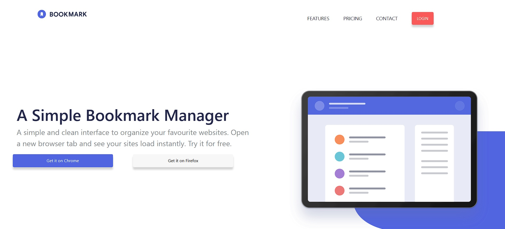
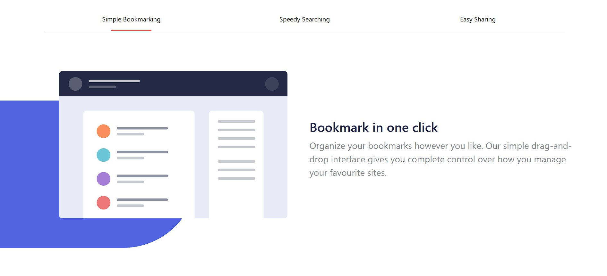
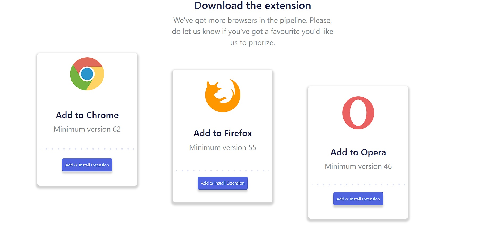
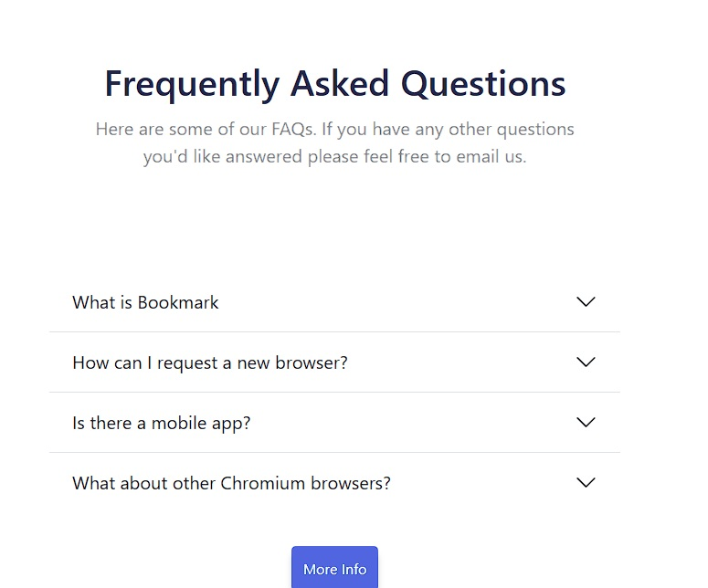

# 1.2 Maquetació I

## Descripció - Enunciat de l'exercici

Aquest exercici consisteix en la maquetació d'una landing page, a partir d'un model, utilitzant HTML, CSS, SASS i Bootstrap.

## Tecnologies utilitzades

- SASS
- Bootstrap

## Requisits

- SASS v1.85.1
- Bootstrap v5.3.3
- Live Server (extensió del Visual Studio Code)

## Instal·lació

- Clona aquest repositori: https://github.com/gerard-asuncion/1.2-Maquetacio-I-Nivell1.git

## Execució

1. Obre els arxius amb el Visual Studio Code.
2. Utilitza l'opció "Open with Live Server" per tal d'obrir l'HTML des del navegador.
3. Els canvis implementats a l'arxiu SASS no són directament visibles, ja que el navegador llegeix un arxiu compilat CSS enlloc de l'arxiu SASS. Per tal d'implementar els canvis a l'arxiu CSS cal utilitzar el comandament: 

sass --watch styles.scss styles.css

## Estructura del projecte 

- Todos los archivos (incluídas las capturas de pantalla) se ubican en la carpeta principal del proyecto, salvo las imágnes, que están en una carpeta "Imágenes" dentro de la carpeta principal.

## Captures

## Contribucions

Les contribucions són benvingudes! Per favor, segueix els següents passos per a contribuir:

1. Fes un fork del repositori
2. Crea una nova branca git checkout -b feature/NovaFuncionalitat
3. Fes els teus canvis i commiteja'ls: git commit -m 'Afegeix Nova Funcionalitat'
4. Puja els canvis a la teva branca: git push origin feature/NovaFuncionalitat
5. Fes un pull request